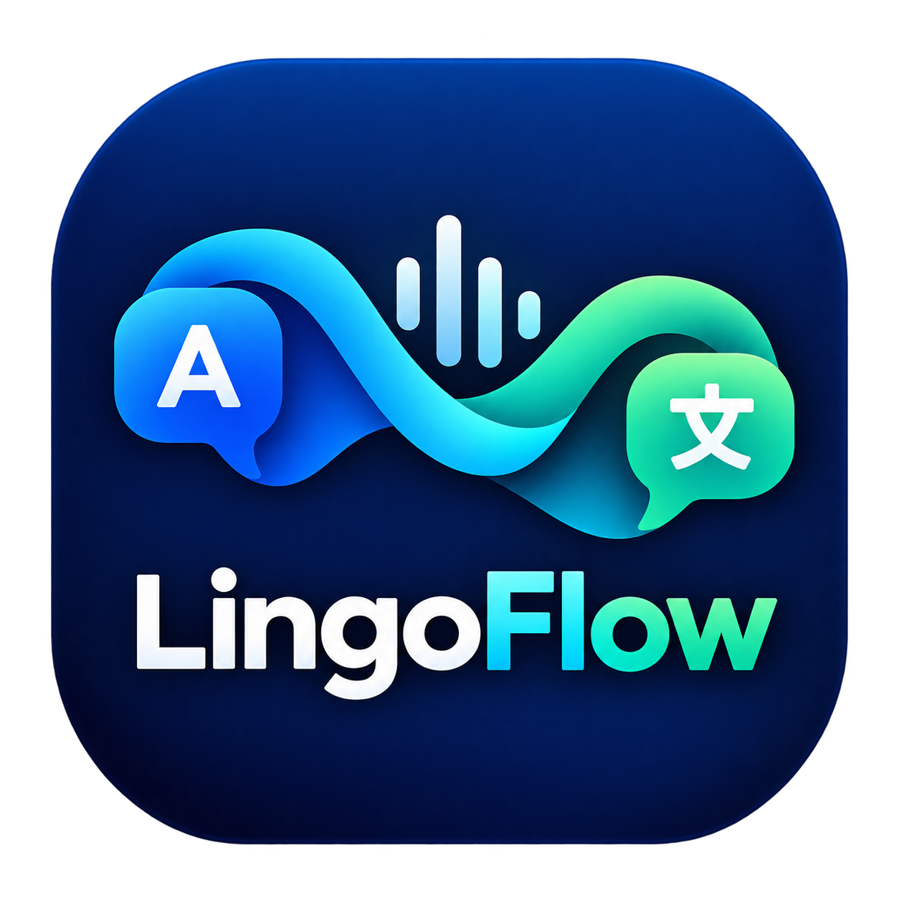

<p align="center">
  
</p>

<h1 align="center">LingoFlow</h1>

<p align="center">
  <a href="https://github.com/PhillipMek/LingoFlow/actions/workflows/ci.yml"></a>
</p>

**Live AI Interpreter.** LingoFlow is a Windows desktop application for real-time
simultaneous interpretation at live events: the console feed is translated on the
fly and returned to the audience channel, with optional subtitle output over NDI
for receivers to display or burn in.

```text
FOH/Console -> Waves SoundGrid -> ASIO -> LingoFlow -> OpenAI Realtime Translation
            -> ASIO -> FOH/Console -> audience headphones
                    LingoFlow -> NDI subtitle output (optional)
```

## Features

* **Real-time translated audio** - persistent streaming session against the OpenAI
  Realtime Translation API (never sentence-at-a-time request/wait/play), with the
  provider's own automatic source-language detection.
* **Professional ASIO audio path** - Waves SoundGrid driver or any ASIO device;
  48 kHz preferred (44.1/88.2 supported end to end); discrete input/output channel
  selection validated against the driver.
* **Click-free operator controls** - input and output gain trims with glide,
  separate input/output mute, peak/RMS meters, latching clip indicators,
  underrun/overrun accounting.
* **Stability engineering** - lock-free preallocated ring and jitter buffers;
  network failures never stop the audio device; automatic session reconnect with
  exponential backoff and provider-ceiling rotation; every degradation is counted
  and visible.
* **Subtitles over NDI** - typed partial/final text pipeline, TTML documents,
  optional output; NDI failure never affects audio.
* **Secure credentials by design** - API key in Windows Credential Manager
  (masked UI), environment fallback for development only; settings, logs and
  diagnostics exports are secret-free by construction and tested with canaries.
* **Diagnostics you can hand to a vendor** - one structured export: audio
  geometry, levels, clipping, ring/jitter fill, underruns, reconnects, session
  duration, honest labelled latency rows, NDI counters, event ring.
* **Developer mode** - WAV-in / test-tone / mock-translation chain runs the whole
  product wiring on a machine with no audio device and no API key
  (`LingoFlow.exe --dev`), and `--dev --smoke` proves start/stop offline.

## Requirements

Production machine:

* Windows 10/11 x64.
* Waves SoundGrid ASIO driver (+ reachable SoundGrid server) - or any ASIO device
  you interpret through.
* OpenAI account with access to the Realtime Translation API; key entered in
  Settings.
* NDI runtime only when subtitle output is used.

Developer machine additionally: Visual Studio 2022 (MSVC), CMake >= 3.25, Git.
JUCE and the ASIO SDK are vendored; nlohmann/json and Catch2 are fetched by CMake.
No Visual C++ redistributable is needed to run the shipped executable.
See `docs/dependencies.md`.

## Build

```powershell
git clone https://github.com/PhillipMek/LingoFlow.git
cd LingoFlow
cmake -S . -B build
cmake --build build --config Release --parallel
```

Debug works identically with `--config Debug`. Two conventions to know: the build
tree must be on an ASCII path (a `juceaide` limitation), and the Visual Studio
generator is multi-config - `--config` selects per command. `docs/CI.md`
reproduces the exact CI command sequence.

## Run

```powershell
build\src\LingoFlow_artefacts\Release\LingoFlow.exe        # operator UI
build\src\LingoFlow_artefacts\Release\LingoFlow.exe --smoke # headless start/stop check
build\src\LingoFlow_artefacts\Release\LingoFlow.exe --dev   # no-device rehearsal chain
build\src\LingoFlow_artefacts\Release\LingoFlow.exe --dev --smoke  # offline proof, exit 0
```

Exit codes: `0` normal; `2` (`--smoke` only) a subsystem refused to start, with
the reason in the log - on a machine without the audio device this is the correct,
documented answer.

## Tests

```powershell
ctest --test-dir build -C Debug --output-on-failure
ctest --test-dir build -C Release --output-on-failure
```

The suite covers the realtime audio pipeline (ring/jitter/gain/meters, an
allocation-counting callback gate, a lexical realtime-safety audit with an
injection self-test), the OpenAI protocol surface against a scripted transport
(handshake, events, malformed frames, expiry announcements, reconnect policy),
the typed text pipeline and NDI dispatch, configuration persistence/corruption,
language capabilities, security credential handling (real Credential Manager
round-trips, canary-key export proofs), fault-injection scenarios and measured
callback-budget headroom bounds. Everything runs without hardware, network or
secrets.

## Configuration

Single Settings area: audio device and channels, sample rate, buffer, gains,
language pair, model hint, jitter buffer, NDI, diagnostics, developer mode.
Settings persist atomically with schema versioning, field-by-field repair and
corruption quarantine; a credential-shaped field in the config file is refused by
definition (`config.json` can never express a secret). The API key lives in the
Windows Credential Manager, never in the settings file.

## OpenAI integration

The backend targets the documented Realtime Translation websocket
(`wss://api.openai.com/v1/realtime/translations?model=gpt-realtime-translate`):
session update with target language, base64 PCM16 input at the documented cadence,
translated audio and transcript deltas, server-announced session expiry. Every
wire assumption is pinned to the official documentation in
`docs/openai-realtime-protocol.md`; capabilities come from a versioned manifest,
not invented lists. Interpreter instructions are carried in settings and reported
as unsupported by the current model instead of being faked.

## Production validation vs CI

GitHub CI (this repo, badge above): builds, the full test suite, hardware-free
smoke. It proves nothing about - and never requires - physical SoundGrid routing,
a live provider session, a real NDI receiver, multi-hour stability or a clean
machine install. Those are venue checks with written protocols:
`docs/rig-checklist.md` (live run sheet) and `docs/release.md` (packaging and the
clean-machine steps).

## Diagnostics, latency, reliability - how the project stays honest

* Latency rows carry their kind (measured / estimated / live-computed / not
  reported); a driver that does not report latency says so, and silence is never
  presented as speed (`docs/latency-budget.md`).
* Every refusal, drop, clamp and degradation increments a counter that reaches
  the UI and the export; errors are never swallowed.
* `Diagnostics...` -> `Export` writes an atomic, secret-free receipt for the
  venue.

## Security

API keys never enter the repository, logs, settings or exports. See
`SECURITY.md`, and `docs/licensing.md` + `THIRD_PARTY_NOTICES.md` for the
licence chain (the application is AGPLv3, following the JUCE linkage rules).

## License

GNU Affero General Public License v3.0 - see `LICENSE` and
`THIRD_PARTY_NOTICES.md`. Vendored `third_party/` components keep their own
licence files.

## Repository map

```text
src/            App (controller + JUCE UI), Audio, Platform/Asio, Network,
                Translation, NDI, Config, Diagnostics, Security, Utils
tests/          unit, integration, realtime (allocation gate), performance,
                support (mocks/fakes), audit scripts (CTest gates)
docs/           architecture, dependencies, protocol references, CI, release,
                rig-checklist, latency-budget, licensing, performance
assets/         application icon (ICO/RC/PNG)
third_party/    vendored JUCE 9.0.3 + ASIO SDK 2.3.4 (licence files included)
packaging/      release-package / install / uninstall scripts (PowerShell)
.github/        CI workflow
```
